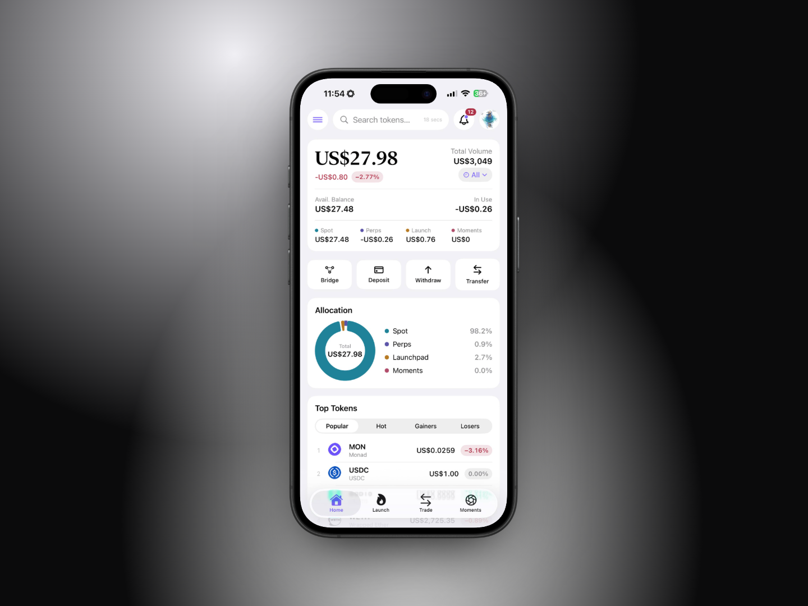

# 👋 Welcome to DyorHQ

<figure><figcaption></figcaption></figure>

## What DyorHQ is

DyorHQ is a native iOS app that talks to Monad mainnet directly. DyorHQ never holds your keys or your funds, and every transaction is shown to you in full before it's sent.

One account, five products:

| Product        | What you do                                                                                                                                                                             | Powered by                  |
| -------------- | --------------------------------------------------------------------------------------------------------------------------------------------------------------------------------------- | --------------------------- |
| 🔁 **Spot**    | Swap Monad tokens. Every swap is quoted on Kuru Flow, Uniswap (v3 and v4) and Monday Trade at the same time and you get the best price.                                                 | Kuru, Uniswap, Monday Trade |
| 📈 **Perps**   | Trade BTC, MON, ETH, SOL, HYPE, ZEC, LIT, VVV, TAO and PUMP perpetuals with isolated margin and leverage up to each market's cap, on a fully on-chain order book, from your own wallet. | Perpl Trade                 |
| 🔥 **Launch**  | Fair-launch a memecoin on a bonding curve, paired with MON, USDC, AUSD or a tokenized T-bill stock (aBIL). Liquidity is locked forever at graduation.                                   | DyorHQ Launchpad contracts  |
| 📸 **Moments** | Publish a photo or video as an NFT on Monad. People collect it for USDC. If enough is collected, it graduates into a tradable coin with a locked liquidity pool.                        | DyorHQ Moments contracts    |
| 🌁 **Bridge**  | Bridge Assets from supported chains to Monad easily                                                                                                                                     | Aurora Intents              |

Plus everything a wallet needs: a Home overview, a Portfolio with volume, fees and P\&L across every product, send and receive, a cross-chain bridge into Monad, notifications and price alerts, and a crypto news feed.

## The DyorHQ edge

* **Self-custodial by design.** DyorHQ never holds your keys: they're kept in your iPhone's Keychain (Email & Password, imported wallets), derived from your passkey, or held by Privy for Apple and Google sign-in. Support can never reach your keys or your funds.
* **Best-price routing.** Three venues compete on every swap. You see all three quotes and pick, or let DyorHQ preselect the best.
* **No DyorHQ fee on swaps.** You pay only the venue's own pool fee and Monad gas.
* **Real yield for creators.** Launchpad creators earn a share of trading fees (or route it to holders). Moment creators earn 20% of every collect and 0.2% of every trade after graduation.
* **Everything on Monad.** Fast, cheap blocks (\~0.4 s) and low gas paid in MON.

## Where to start

1. [Quickstart (Onboarding)](getting-started/quickstart.md): from the waitlist to your first swap.
2. [Create Your Account](getting-started/create-your-account.md): sign in with Email & Password, Apple, Google or a passkey, import a wallet, or watch an address.
3. [Fund Your Wallet](getting-started/fund-your-wallet.md): what you need (MON for gas, USDC or AUSD to trade).


DyorHQ is in early access. Contracts are live on Monad mainnet and real funds are involved. Read the [Risk Disclosures](resources/risk-disclosures.md) before you trade, launch or collect.

