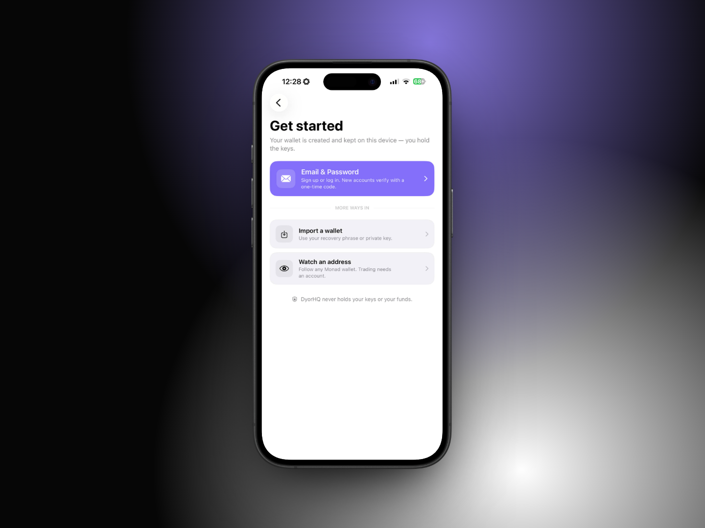

# 👤 Create Your Account

DyorHQ has no "account" in the usual sense. What you create is a **wallet**, and the app is built around it. These ways in are live today:

| Method                                                                     | Best for                                  | Can sign transactions? | Where the key lives                                                                                                                                               |
| -------------------------------------------------------------------------- | ----------------------------------------- | ---------------------- | ----------------------------------------------------------------------------------------------------------------------------------------------------------------- |
| **Email & Password**                                                       | New users                                 | Yes                    | Recreated on your iPhone from your email + password (with a step on DyorHQ's server), then stored in the iPhone Keychain                                          |
| **Continue with Apple / Continue with Google**                             | People who'd rather not manage a password | Yes                    | A Privy embedded wallet, secured by your Apple or Google sign-in. The same sign-in opens it on any device. DyorHQ never holds the key                             |
| **Passkey** ("Create account with a passkey" / "I already have a passkey") | Face ID sign-in with no password          | Yes                    | Derived from your passkey every time you unlock it and never stored, on this device or on a server. iCloud Keychain keeps the passkey on your other Apple devices |
| **Import a wallet**                                                        | People with an existing wallet            | Yes                    | Imported into the iPhone Keychain (this device only)                                                                                                              |
| **Watch an address**                                                       | Following a wallet without controlling it | No                     | No key at all                                                                                                                                                     |

On the "Get started" screen, **Email & Password** is the card at the top. Apple, Google and the two passkey buttons sit under "or continue with", and **Import a wallet** and **Watch an address** sit under "more ways in".

<figure><figcaption></figcaption></figure>

## Email & Password

Tap the **Email & Password** card. The screen has a **Sign Up / Log In** switch at the top.

### How it works

Your wallet is derived from your email and password. A very slow key-stretching function runs on your phone, and its result is combined with a value from DyorHQ's server to create the wallet's key. The server only receives one-way hashes, never your password or your key. This means:

* The **same email and password always give the same wallet**, on any iPhone. DyorHQ's backend never holds the key: it links your verified email to your wallet address and supplies that server value, so logging in needs a connection to DyorHQ.
* There is **no reset**. A different password produces a different wallet.
* The wallet's security is exactly the strength of your password. Pick a long, unique one.

### Sign Up

1. Enter your **Email**, a **Password** and **Confirm password**.
2. Watch the **Password strength** meter (Weak → Strong). The password must be:
   * At least **12 characters**
   * A mix of **any three** of: uppercase, lowercase, numbers, symbols
   * Not a common password, not built on your email, no repeats or simple sequences ("aaaa", "1234"), and not built on words like "password", "dyorhq", "qwerty", "letmein", "monad", "crypto" or "wallet"
3. Turn on **"I understand my password is the only way back to my wallet"**.
4. Tap **Continue**. We email you a **6-digit code**.
5. Enter the code on the **Verify your email** screen (it submits automatically on the sixth digit). Use **Send a new code** if it didn't arrive, or **Change details** to go back.

Once verified, your wallet is created and you're signed in. The code proves the email is yours, so nobody can register a wallet against an email they don't own.

### Log In

Switch to **Log In**, enter the same email and password, tap **Log In**. Usually no code is needed: your wallet is recreated on this iPhone and, if it matches a verified sign-up, you're in. If the app asks you to verify your email, tap **Verify Email** and enter the 6-digit code we email you; you're logged in right after. Signed up before September 24, 2026? Tap **Check for an Older Account** when it appears.

If you see "We couldn't find a verified account for that email and password", either the password is different (which means a different wallet) or that email never completed sign-up.

### Forgot password?

Tap **Forgot password?** on the Log In screen, enter your email and a **new** password, then confirm the emailed code.


**Resetting your password creates a new, empty wallet.** Your email is re-linked to the new wallet, but the old wallet's funds still need the old password. If you had funds, keep trying to recall the old password, or use the old wallet's exported key if you saved one.


## Apple or Google

Tap **Continue with Apple** or **Continue with Google** and finish the sign-in in the sheet that opens. Your wallet is a Privy embedded wallet secured by that sign-in, and the same sign-in opens it on any device. Key export isn't available for these wallets yet; see [Export, Sign Out & Delete Account](../wallet/export-sign-out-delete.md).

## Passkey

* **Create account with a passkey** creates a new wallet from a new passkey, confirmed with Face ID. There's no password to remember.
* **I already have a passkey** signs in with a DyorHQ passkey you made before, whether it's on this iPhone, in iCloud Keychain or on another device.

The wallet is derived from your passkey every time you unlock it and is never stored. The same passkey gives the same wallet on any device. To keep a backup that works without the passkey, export its 24-word recovery phrase (Profile → Manage Wallets → **Export Recovery Phrase**).

## Import a wallet

Tap **Import a wallet** (or, when watching an address, Profile → Manage Wallets → **Import an Existing Wallet**).

1. Pick **Recovery Phrase** or **Private Key** at the top.
2. Paste or type it. Use **Paste** to read from the clipboard and **Reveal / Hide** to check what you typed.
   * Recovery phrase: 12 or 24 words (15, 18 and 21-word phrases are also accepted), separated by spaces. DyorHQ derives the first account on the standard Ethereum path, the same one MetaMask, Rabby and OKX use.
   * Private key: 64 hex characters, with or without the `0x` prefix.
3. When the input is valid, a **Wallet found** row shows the address. Check it's the one you expect.
4. Tap **Import Wallet**.

The key is stored only on this iPhone, in the Keychain, and never synced to iCloud or sent anywhere. DyorHQ cannot recover it, so keep your original backup. After import the app clears your clipboard if it still holds the secret.

## Watch an address

Tap **Watch an address**, paste any 42-character Monad address (starting with `0x`), and tap **Watch**.

You'll see balances, positions, launches and Moments for that address. Nothing can be signed: Send is disabled, every trade button says "Sign in to trade", and there's no key to export. An eye icon in the header reminds you you're watching. To leave, go to Profile → **Stop Watching**.

## Switching wallets

Only one wallet is active at a time. Signing in with a new method replaces the previous one (Profile → **Sign Out** first, or **Forget This Device** for a passkey account). See [Export, Sign Out & Delete Account](../wallet/export-sign-out-delete.md) for what sign-out does to each wallet type before you switch.


For **Email & Password** and **imported** wallets, signing out deletes the key from this iPhone. You'll need your password or your backup phrase/key to get back in.

