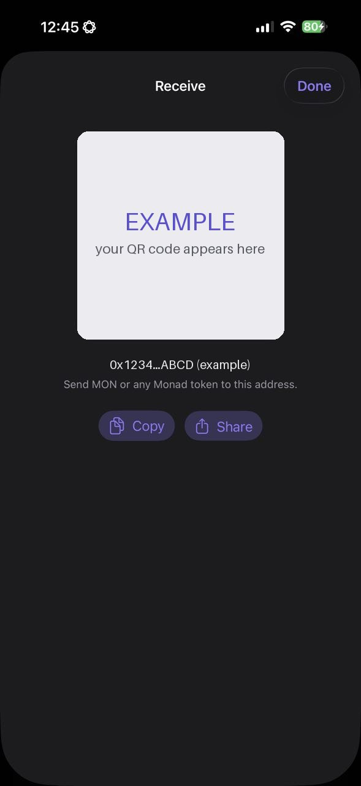

# Fund Your Wallet

DyorHQ runs on **Monad mainnet**. To do anything beyond watching, your wallet needs a little MON and whatever asset you want to trade with.

## What you need

| Asset    | Used for                                        | Notes                                                                                                                                             |
| -------- | ----------------------------------------------- | ------------------------------------------------------------------------------------------------------------------------------------------------- |
| **MON**  | Gas on every transaction                        | Keep some at all times. When you swap 100% of your MON, DyorHQ automatically keeps about 0.02 MON back for gas.                                   |
| **USDC** | Swaps, collecting Moments, Launchpad pair asset | Moments are priced and settled in USDC only.                                                                                                      |
| **AUSD** | Perps collateral, Launchpad pair asset          | Perpl's collateral. First deposit is at least 10 AUSD. If you hold MON but no AUSD, the Transfer sheet can swap MON → AUSD for you on the way in. |
| **aBIL** | Launchpad pair asset (tokenized T-bill stock)   | Coins paired with aBIL graduate on Monday Trade.                                                                                                  |

Any other Monad token works for swapping.

## Your receive address

1. On **Home**, tap **Deposit**. (Also: Profile → **Receive**.)
2. The Receive sheet shows a QR code and your full address.
3. Tap **Copy** or **Share**, or let the sender scan the QR.

Send **only Monad-network assets** to this address. Sending from another chain without a bridge will not arrive.

<figure><figcaption>
Example only — always use the address shown in your own app.
</figcaption></figure>

## Ways to get funds onto Monad

* **From an exchange:** withdraw MON (or USDC) to your DyorHQ address on the Monad network, if your exchange supports Monad withdrawals.
* **From another wallet on Monad:** send to your address as usual.
* **From another chain:** tap **Bridge** on Home. DyorHQ's built-in bridge (powered by Aurora Intents) moves USDC and other assets from Ethereum, Base, Arbitrum, Optimism, Polygon, BNB Chain, Avalanche, Gnosis, Scroll or Berachain straight into your Monad wallet. See [Bridge](../wallet/bridge.md).

## Check your balance

Your **Home** hero card shows total value, **Avail. Balance** (spot) and **In Use** (perps). The **My Holdings** card lists every token you hold with its value and 24h change. Home refreshes every 30 seconds and on pull-to-refresh.

## Running low on gas

If a transaction fails with **"Not enough MON to pay for gas."**, top up MON. Everything else can wait; gas can't.
