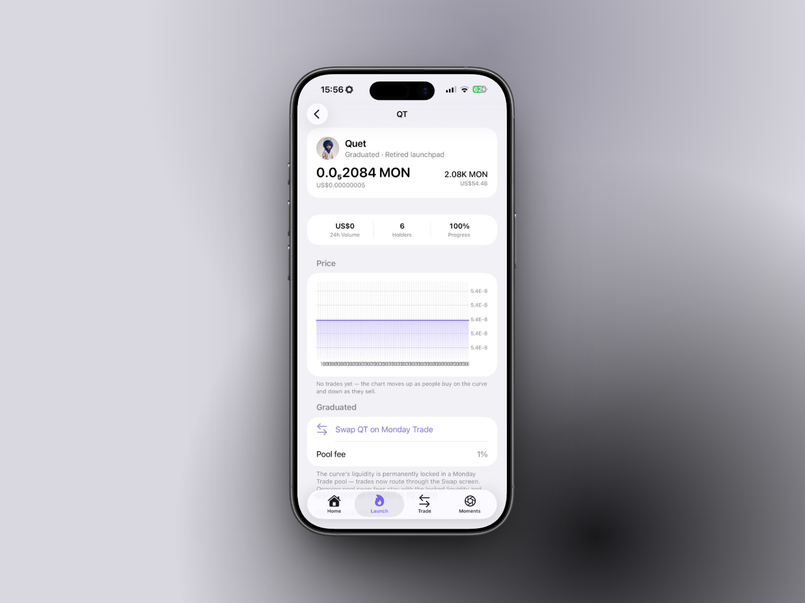

# 🎓 Graduation

Graduation is the moment a coin leaves its bonding curve and becomes a normal token with a permanently locked liquidity pool.

## When it happens

The curve tracks how much of the pair asset it has raised (net of fees). When a buy pushes that amount to the pair's threshold, the curve is complete and graduation runs **in the same transaction**. The final buy is clamped to exactly what the curve needs; any excess is refunded to the buyer.

| Pair asset | Threshold                                                            |
| ---------- | -------------------------------------------------------------------- |
| MON        | $4,324.56 worth of MON at the price when the launchpad was deployed  |
| USDC       | 4,324.56 USDC                                                        |
| AUSD       | 4,324.56 AUSD                                                        |
| aBIL       | $4,324.56 worth of aBIL at the price when the launchpad was deployed |

The MON and aBIL thresholds are fixed when the launchpad is deployed; the coin page shows each coin's own threshold ("Graduates at X \<PAIR> raised").

## What happens at graduation

1. The raised pair asset and the coins the curve never sold are swept out of the curve. Only the coins the final price implies (about 21.6% of supply) go into the pool; the rest (10% of supply) is held in the locker outside the pool.
2. A pool is created at the **curve's final price** so there's no jump between the last curve trade and the first pool trade:
   * **Uniswap v4**: a full-range position in the canonical Uniswap v4 PoolManager on Monad, with the DyorHQ hook attached (that's what charges the 1% pool fee and creator tax). Locked in the DyorHQ **LaunchLocker**.
   * **Monday Trade**: a full-range position in a Monday spot pool at the 1% fee tier. Native-MON coins pair with WMON on Monday. Locked in the DyorHQ **Monday fee vault**.
3. The position is locked. **Neither locker has a function that removes liquidity**, not for the creator, not for DyorHQ. Only earned fees can ever leave.
4. The coin's page switches to **Graduated**, shows a **Pool fee** row (1% on either venue; on Uniswap v4 the DyorHQ hook charges it, because the pool's own LP fee is 0%) and a **Swap TICKER on \<VENUE>** button that opens the Swap screen with the pair preselected.

## Choosing the venue

<figure><figcaption></figcaption></figure>

The creator picks **Uniswap v4** or **Monday Trade** at launch. aBIL-paired coins can only graduate on Monday Trade (that's where aBIL has liquidity).

## Trading after graduation

Graduated coins trade through **Swap**. Uniswap v4 quotes include graduated Launchpad pools automatically (the route text is tagged "launchpad"); Monday-graduated coins are quoted by the Monday Trade venue. The pool fee is 1% via the DyorHQ hook on Uniswap v4, or Monday's 1% tier on Monday Trade. See [Creator Fees & Holder Rewards](fees-and-rewards.md) for where those fees go.

The Launchpad page still tracks a graduated coin's price (read live from its Uniswap v4 or Monday Trade pool, or the curve's final price if the pool can't be read) and market cap, and lists it under **Graduated**.
