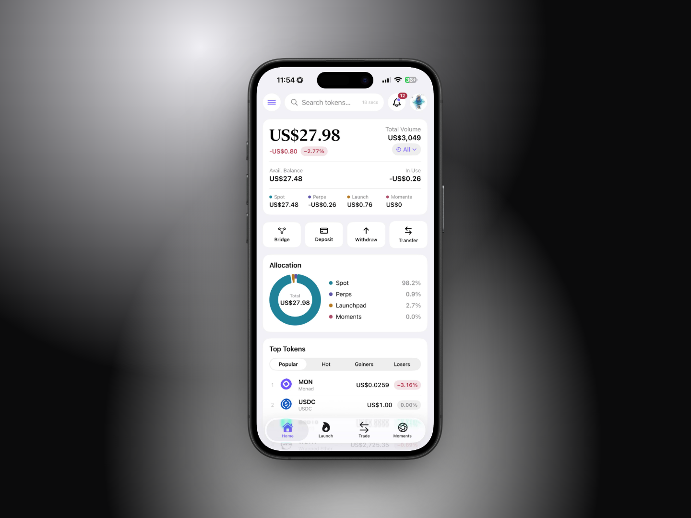
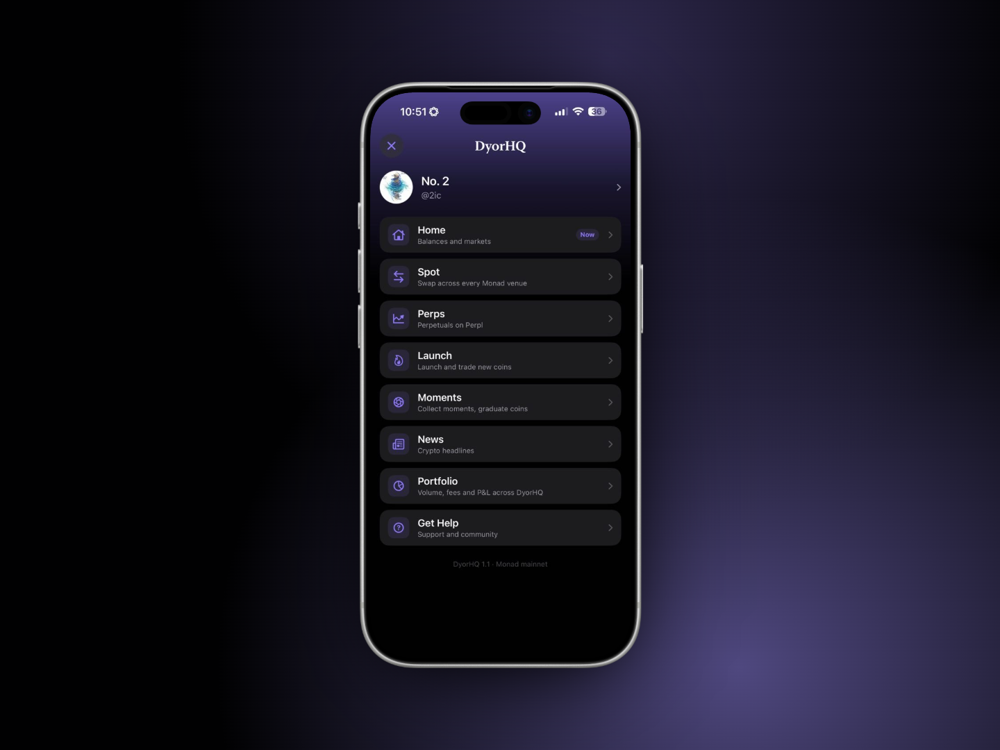

# App Tour

A map of every screen in DyorHQ so you always know where you are.

<figure><figcaption></figcaption></figure>

## The tab bar

| Tab            | What's there                                                                                                     |
| -------------- | ---------------------------------------------------------------------------------------------------------------- |
| 🏠 **Home**    | Total value, quick actions (Bridge, Deposit, Withdraw, Transfer), Portfolio allocation, Top Tokens, My Holdings. |
| 🔥 **Launch**  | The Launchpad: graduated coins, coins still on the curve, search, **New Launch** and **My Launchpad**.           |
| 🔁 **Trade**   | Two modes under one tab, switched at the top: **Swap** (spot) and **Perps** (Perpl).                             |
| 📸 **Moments** | The Moments feed (All / Collecting / Graduated), **Publish** and **My Moments**.                                 |

Trade sits between Launch and Moments on purpose: it divides the two "coin" sections.

## The Home header

From left to right:

* **☰ Menu**: opens the side menu (below).
* **Search tokens…**: jumps to any token's detail page (price, 24h chart, your balance, Swap button).
* **Refresh status**: a small relative time since the last refresh (for example "2 min"), or a warning icon if the last refresh failed.
* **🔔 Notifications**: the in-app notification center, with an unread badge.
* **Avatar**: opens your Profile. Watch-only sessions show an eye icon instead.

## The side menu (☰)

| Item      | Subtitle in the app                 | Opens                 |
| --------- | ----------------------------------- | --------------------- |
| Home      | Balances and markets                | Home tab              |
| Spot      | Swap across every Monad venue       | Trade tab, Swap mode  |
| Perps     | Perpetuals on Perpl                 | Trade tab, Perps mode |
| Launch    | Launch and trade new coins          | Launch tab            |
| Moments   | Collect moments, graduate coins     | Moments tab           |
| News      | Crypto headlines                    | Full-screen News      |
| Portfolio | Volume, fees and P\&L across DyorHQ | Full-screen Portfolio |
| Get Help  | Support and community               | Full-screen Support   |

The profile row at the top opens **Profile**. The footer shows the app version and "Monad mainnet".

<figure><figcaption></figcaption></figure>

## Screens outside the tabs

* **Profile**: wallet actions (Receive, Send, Recent Activity), every setting, network info, Sign Out and Delete Account. See [Profile & Settings](../wallet/profile-and-settings.md).
* **Portfolio**: cumulative volume, fees, P\&L and trade counts by product and period, holdings (Assets / NFTs) and full activity. See [Home & Portfolio](../wallet/home-and-portfolio.md).
* **News**: headlines from CoinDesk, Cointelegraph, Decrypt, The Defiant and The Block, filterable by source, opened in an in-app browser.
* **Notifications**: everything the app has told you, grouped by day, filterable by kind.
* **Get Help**: email support, bug report, X, website and Terms of Use. See [Official Links & Support](../resources/official-links.md).

## Conventions you'll see everywhere

* **Every wallet transaction goes through a confirmation sheet** that lists exactly what will be sent (amounts, venue, route, minimums) and then shows each step as it's sent and confirmed, with a **View** link to Monadscan. The two exceptions are the bridge (its summary is the review) and One-Click perp orders (signed by your Perpl trading key).
* **Gains and losses always carry a sign or a word**, never colour alone. Green means Long / Up, red means Short / Down (legend under Profile → Appearance).
* **Amounts use tabular figures** so columns line up.
* **Pull to refresh** works on Home, Portfolio, Recent Activity and the Perps Portfolio. Swap and Perps refresh themselves (quotes every 15 seconds, Perpl every 8 seconds); Home also refreshes itself every 30 seconds.
* **Watch-only** sessions can read everything, but every action ends in a "Sign in to trade" message, either on the button or in the confirmation sheet.
