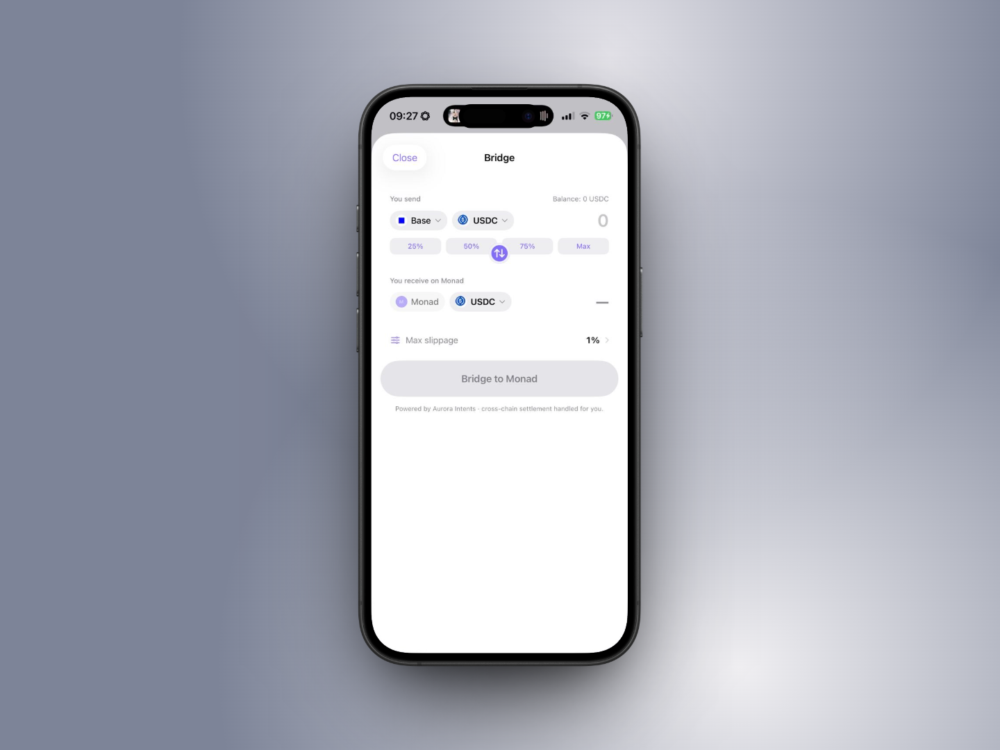

# 🌉 Bridge

DyorHQ's bridge is powered by **Aurora Intents** (NEAR Intents). You send on one chain, Aurora settles across chains, and the funds arrive in your DyorHQ wallet on Monad, or the other way round.

**Where:** Home → **Bridge**.

<figure><figcaption></figcaption></figure>

## Supported chains

One side is always **Monad**. The other can be: Ethereum, Base, Arbitrum, Optimism, Polygon, BNB Chain, Avalanche, Gnosis, Scroll or Berachain. The default is **Base → Monad**; a flip button reverses direction.

Tokens come from Aurora's list for each chain, with stablecoins (USDC, USDT0, USDT) first. The **Bridge from** picker lists every asset you hold across the supported chains, largest value first, with balances read from public RPCs.

## How to bridge

1. Pick the source chain and token. Enter an amount (25% / 50% / 75% / **Max**).
2. Read the summary: **You receive**, **Minimum received**, **Total fee** (one dollar figure and percentage covering Aurora's protocol fee, withdrawal fee, spread and any DyorHQ integrator fee), **Slippage** (default 1%, adjustable), **Estimated time**, **Route**.
3. Tap **Bridge to Monad** (or **Bridge to \<Chain>**). There's no separate confirmation sheet: the summary above the button is the review. With Require Face ID on, confirm with Face ID.
4. The app sends exactly the quoted amount to Aurora's deposit address on the source chain, notifies Aurora, and tracks the status for up to about ten minutes.

## Status messages

_Sending on \<Chain>…_ → _Notifying the bridge…_ → _Confirming your deposit…_ → _Waiting for the full deposit…_ → _Bridging across chains…_ → **Arrived** (or **Refunded** / **Failed**).

When it lands: "Arrived on Monad · Received X", with a **View** link that upgrades from the deposit transaction to the destination transaction. If it's slow you'll see _"Still settling, this can take a minute. Check your balance on \<Chain>; DyorHQ keeps checking while it's open."_ and later _"Taking longer than usual. Check your balance on \<Chain>; DyorHQ checks again each time you open it."_ The bridge itself completes on its own. DyorHQ tracks its status while the app is open (and again when you reopen it), and it shows in your balance and Activity once it lands. A refund returns funds on the source chain and tells you why.

Completed bridges appear in Portfolio under **Bridge** and post a "Bridge complete" notification.

## Fees

Aurora's quote includes its protocol fee, withdrawal fee and spread, plus DyorHQ's 0.1% integrator fee. Everything is shown in the **Total fee** row before you confirm.
