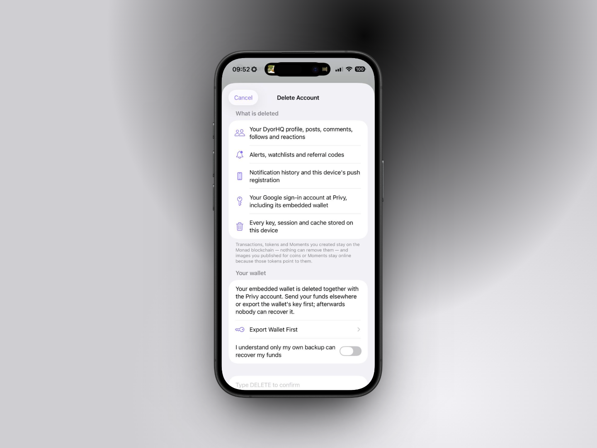

# 🚪 Export, Sign Out & Delete Account

## Export your wallet

**Where:** Profile → **Manage Wallets** → **Export Wallet** (**Export Recovery Phrase** for passkey accounts).

### Imported and Email & Password wallets

Tap **Reveal Private Key**. Face ID (or Touch ID) is required. The key appears on screen; **Copy Private Key** copies it for 90 seconds, after which it's cleared from the clipboard; **Hide** hides it again. The key is hidden automatically whenever the app leaves the foreground. An Email & Password wallet can also be recreated on any iPhone from the same email and password.

The screen's warnings are worth repeating:

* _Anyone with this key has full control of your funds. Never share it. DyorHQ support will never ask for it._
* _Only enter it into a wallet you trust (MetaMask, Rabby, OKX…). A hardware wallet is safest._

### Apple and Google accounts

Key export isn't available for these wallets; the screen reads _"Key export for this wallet type isn't set up in this build yet."_ To move your funds, send them to another wallet.

### Passkey accounts

**Export Recovery Phrase** shows the 24-word recovery phrase your passkey derives, so you can restore the wallet in another wallet app without the passkey. It asks for your passkey every time, hides after a minute unless you tap **Keep Showing**, and is never stored.

### Watch-only

Nothing to export: _"You're watching this address, there's no key to export."_

## Sign out

**Where:** Profile → **Sign Out** (or **Stop Watching**; passkey accounts see **Forget This Device** instead). With Require Face ID on, signing out asks for Face ID first.

| Wallet type                      | What sign-out does                                                                                                     |
| -------------------------------- | ---------------------------------------------------------------------------------------------------------------------- |
| **Email & Password**             | Deletes the key from this iPhone. Log in again with the same email and password to recreate it.                        |
| **Apple / Google**               | Signs you out. Your wallet stays with your account; sign in again to use it.                                           |
| **Passkey** (Forget This Device) | Erases this iPhone's copy of the account. Your passkey keeps the account and its funds; sign in with it again anytime. |
| **Imported**                     | Deletes the key from this iPhone. Import it again from your phrase or key.                                             |
| **Watch-only**                   | Stops showing that address.                                                                                            |


Signing out removes the wallet key from the device. Make sure you have your password (Email & Password) or your recovery phrase / private key (imported) before you sign out.


Signing out also forgets the Perpl trading session and social session for that wallet. Signing back in re-binds them.

## Delete account

**Where:** Profile → **Delete Account** (at the bottom of Profile).

<figure><figcaption></figcaption></figure>

### What is deleted

* Your DyorHQ profile, posts, comments, follows and reactions
* Alerts, watchlists and referral codes
* Notification history and this device's push registration
* Every key, session and cache stored on this device
* For Email & Password wallets: the email link, so the same email and password won't log back into a deleted account
* For Email & Password wallets: the Privy account that verified your email, unless it's also another way into DyorHQ
* For Apple and Google accounts: your sign-in account at Privy, including its embedded wallet
* For passkey accounts: your passkey (DyorHQ asks your passkey app to remove it)

### What is kept

_Transactions, tokens and Moments you created stay on the Monad blockchain, nothing can remove them, and images you published for coins or Moments stay online because those tokens point to them._

**Your funds are not touched on-chain**, but for Apple/Google and passkey accounts, deleting also deletes the wallet's only key. Whether you can reach your funds again depends on your own backup:

| Wallet type      | The app's warning                                                                                                                                                                                                                                                       |
| ---------------- | ----------------------------------------------------------------------------------------------------------------------------------------------------------------------------------------------------------------------------------------------------------------------- |
| Email & Password | _This wallet is recreated from your email and password. Removing it deletes the device copy; keep your email and password, the only way back to the funds. A password reset can't bring them back: it creates a new, empty wallet._                                     |
| Apple / Google   | _Your embedded wallet is deleted together with the Privy account. Send your funds elsewhere or export the wallet's key first; afterwards nobody can recover it._ Key export isn't available for these accounts, so send your funds to another wallet before you delete. |
| Passkey          | _Deleting removes your passkey, which is this wallet's only key. Assume this is permanent unless you export the recovery phrase first._ The screen offers **Export Recovery Phrase** and **Move Funds Out** before you delete.                                          |
| Imported         | _This wallet's private key is removed from this device. Keep its recovery phrase or key somewhere safe; it is the only way back to the funds._                                                                                                                          |

### Steps

1. Read the list and turn on **"I understand only my own backup can recover my funds"**. Passkey accounts instead export and confirm the recovery phrase, or turn on **"I understand I may permanently lose these funds"**.
2. Type **DELETE** in the confirmation field.
3. Tap **Delete Account**. With Require Face ID on, confirm with Face ID first. Your wallet signs one message so the server can verify it's you, then everything above is removed. _This cannot be undone._
   * Passkey accounts tap **Delete with Face ID** instead. Face ID confirms it's your passkey. Your data on the server is deleted first; then DyorHQ asks your passkey app to remove the passkey and clears this iPhone. If the passkey may still be there (on iOS 18, in another password manager, or on another phone), the last screen lists the steps to delete it yourself.
