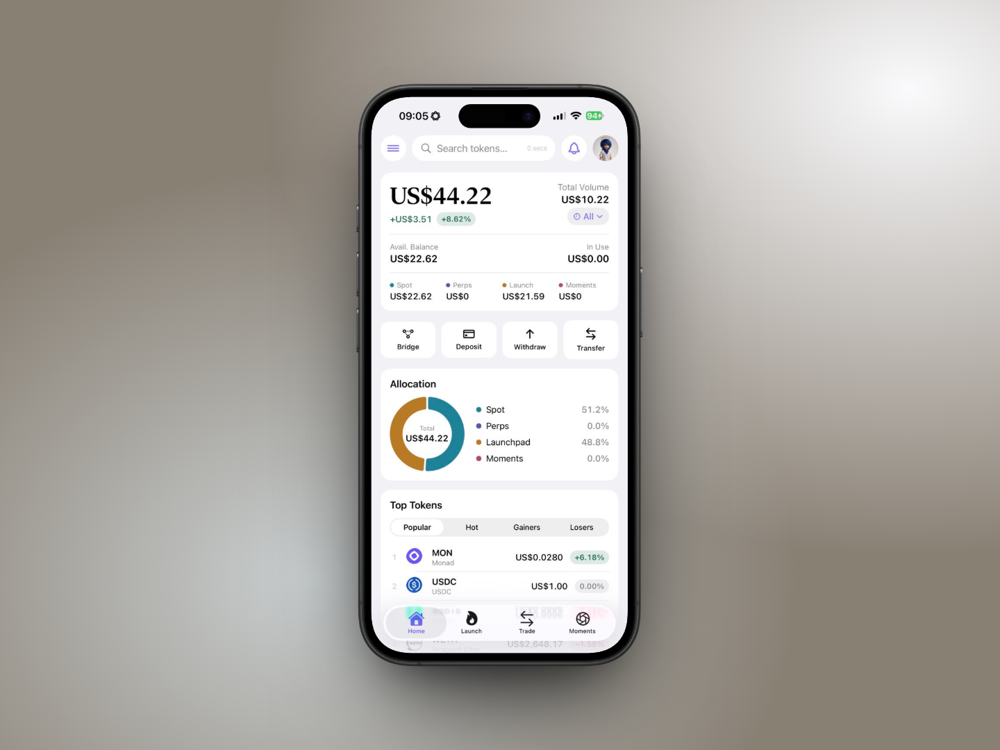
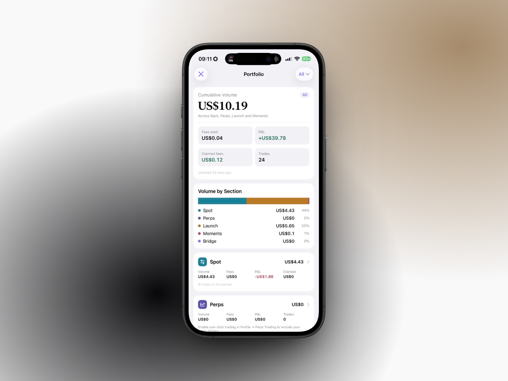

# 🏠 Home & Portfolio

## Home

The Home tab is your overview. It refreshes every 30 seconds and on pull-to-refresh.

<figure><figcaption></figcaption></figure>

### Hero card

* **Total value** in USD = Spot + Perps + Launch + Moments.
* **24h change** in USD and %, weighted across your priced holdings.
* **Total Volume** with a period picker (24h / 7 days / 30 days / All). Tap it to open Portfolio.
* **Avail. Balance** (spot) and **In Use** (Perpl equity).
* The **Spot / Perps / Launch / Moments** split.

### Quick actions

| Button       | Opens                                                          |
| ------------ | -------------------------------------------------------------- |
| **Bridge**   | Cross-chain bridge to and from Monad (see [Bridge](bridge.md)) |
| **Deposit**  | Your Receive sheet (QR + address)                              |
| **Withdraw** | The Send sheet                                                 |
| **Transfer** | Spot ↔ Perps collateral transfer                               |

### Allocation

A donut of Spot / Perps / Launchpad / Moments with percentages. Shown once you hold anything.

### Top Tokens

Six tokens per tab: **Popular** (the curated list), **Hot** (largest absolute 24h move), **Gainers**, **Losers**. Tap one for its detail page: price, 24h chart, your balance and value, contract, decimals, **Swap SYM** and **View on Monadscan**.

### My Holdings

Tabs **Spot / Perps / Launch / Moments**. Spot rows show amount, value, price and 24h change; Perps rows show side, leverage, size, entry price and unrealized P\&L; Launch rows show progress or phase; Moments rows show editions, coins and state. Tokens you hold that aren't on the curated list are discovered on-chain and added automatically; the ones you didn't pick or swap into in Swap are marked **Unverified**. See [Adding Any Monad Token](../spot/adding-tokens.md).

## Portfolio

**Where:** side menu → Portfolio, or tap Total Volume on Home.

<figure><figcaption></figcaption></figure>

Everything here is computed from your wallet's own on-chain history.

* **Cumulative Volume** for the selected period, "Across Spot, Perps, Launch and Moments".
* **Fees paid**, **P\&L** (marked \* when a source is incomplete), **Claimed fees**, **Trades**.
* **Volume by Section**: a bar and legend for Spot, Perps, Launch, Moments, Bridge.
* One **card per section** with Volume, Fees, P\&L, Claimed (or Trades for Perps) and the trade count. Tap a card to jump to that tab. The Perps card notes _"Enable one-click trading in Profile → Perpl Trading to include your perps history."_ until you do.
* **My Holdings**: **Assets** (top 6, "Show all") and **NFTs** (your Moment editions and other NFTs).
* **Activity**: every swap, perp fill, curve trade, claim, collect, publish, Moment proceeds or pool-fee withdrawal and bridge in the period, with Monadscan links. Plain wallet sends and Perpl deposits/withdrawals live in Recent Activity instead.

## Recent Activity

Profile → **Recent Activity** is the simpler, chronological list: launches, swaps, buys, sells, perp orders, sends, collects and claims from this device plus the last week of on-chain activity, each linking to Monadscan.
