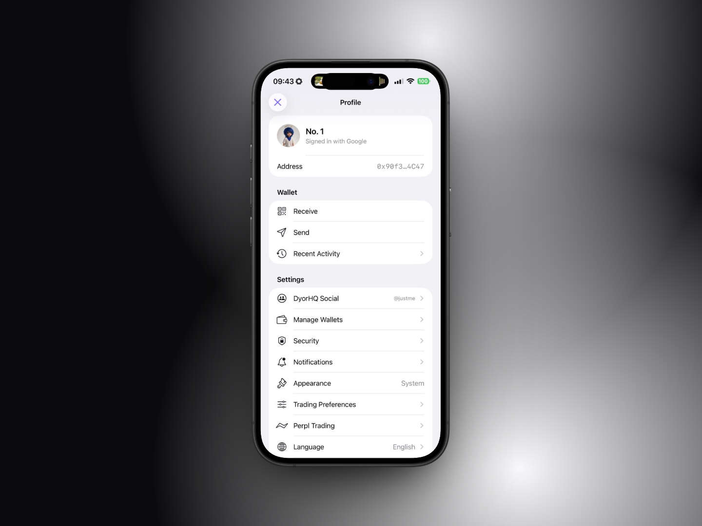

# ⚙️ Profile & Settings

**Where:** tap your avatar on Home, or the profile row at the top of the side menu.

<figure><figcaption></figcaption></figure>

## Header

Your avatar (or initials), your display name or handle, "Signed in with \<method>" (or "Watching this address"), and your **Address** with a long-press menu: **Copy Address**, **View on Monadscan**.

## Wallet

| Row                 | Does                                         |
| ------------------- | -------------------------------------------- |
| **Receive**         | QR + address sheet                           |
| **Send**            | Send sheet (disabled in watch-only)          |
| **Recent Activity** | Chronological list of everything you've done |

## Settings

| Row                     | What's inside                                                                                                                                                                                                                                                                                                                                                                                                                                                                                                                                                                                                                                     |
| ----------------------- | ------------------------------------------------------------------------------------------------------------------------------------------------------------------------------------------------------------------------------------------------------------------------------------------------------------------------------------------------------------------------------------------------------------------------------------------------------------------------------------------------------------------------------------------------------------------------------------------------------------------------------------------------- |
| **DyorHQ Social**       | Your handle, display name, bio and photo. See [DyorHQ Social](dyorhq-social.md).                                                                                                                                                                                                                                                                                                                                                                                                                                                                                                                                                                  |
| **Manage Wallets**      | Address, sign-in method, account label, **View on Monadscan**, **Copy Address**, **Export Wallet** (**Export Recovery Phrase** for passkey accounts), network details (Chain: Monad mainnet, Chain ID: 143, RPC). Watch-only sessions get **Import an Existing Wallet** here.                                                                                                                                                                                                                                                                                                                                                                     |
| **Security**            | **Passkeys** and **App Lock**: **Require Face ID** (or Touch ID). On by default for a new install on an iPhone with a passcode. When it is on, the app asks for Face ID (or your passcode) before every transaction is signed, One-Click perp orders included. It also asks before connecting Perpl trading, signing out, deleting your account or turning App Lock off. Passkey accounts don't use it, because their passkey is the lock. If no biometrics are enrolled and App Lock is off, the toggle is replaced by "No biometrics enrolled on this device." On an iPhone with only a passcode, App Lock starts on and asks for the passcode. |
| **Notifications**       | Master switch, Swaps & Fills, Price Alerts, Manage Price Alerts. See [Notifications & Price Alerts](notifications-and-price-alerts.md).                                                                                                                                                                                                                                                                                                                                                                                                                                                                                                           |
| **Appearance**          | **System / Light / Dark**, plus the colour legend: green = Long / Up, red = Short / Down.                                                                                                                                                                                                                                                                                                                                                                                                                                                                                                                                                         |
| **Trading Preferences** | **Default Leverage** (1–50, default 2×; each market still caps it) and **Max Slippage** for perps market orders (0.1% / 0.5% / 1% / 2%, default 0.5%).                                                                                                                                                                                                                                                                                                                                                                                                                                                                                            |
| **Perpl Trading**       | Connect, enable one-click trading, reconnect, remove API key. See [One-Click Trading](../perps/one-click-trading.md).                                                                                                                                                                                                                                                                                                                                                                                                                                                                                                                             |
| **Language**            | English. "DyorHQ follows your device language. More languages are coming."                                                                                                                                                                                                                                                                                                                                                                                                                                                                                                                                                                        |
| **Support**             | The Get Help screen.                                                                                                                                                                                                                                                                                                                                                                                                                                                                                                                                                                                                                              |
| **Terms of Use**        | Opens dyorhq.fun/terms.                                                                                                                                                                                                                                                                                                                                                                                                                                                                                                                                                                                                                           |
| **Privacy Policy**      | Opens dyorhq.fun/privacy.                                                                                                                                                                                                                                                                                                                                                                                                                                                                                                                                                                                                                         |

## Network

**Chain**: Monad mainnet · **RPC**: the host the app is talking to (rpc.monad.xyz by default).

## Bottom of the screen

**Sign Out** (or **Stop Watching**; passkey accounts get **Forget This Device** instead) and **Delete Account**. See [Export, Sign Out & Delete Account](export-sign-out-delete.md).
